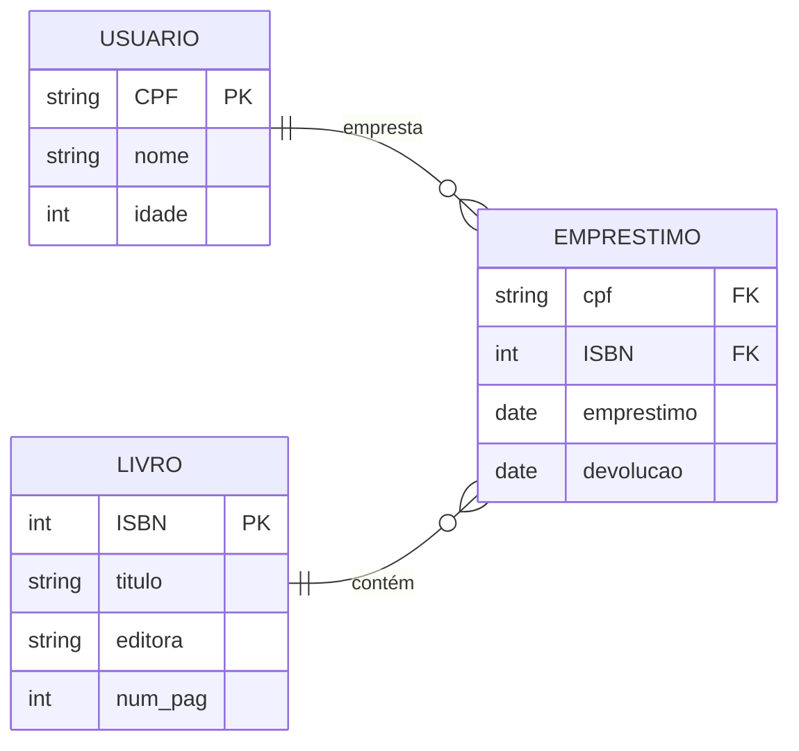
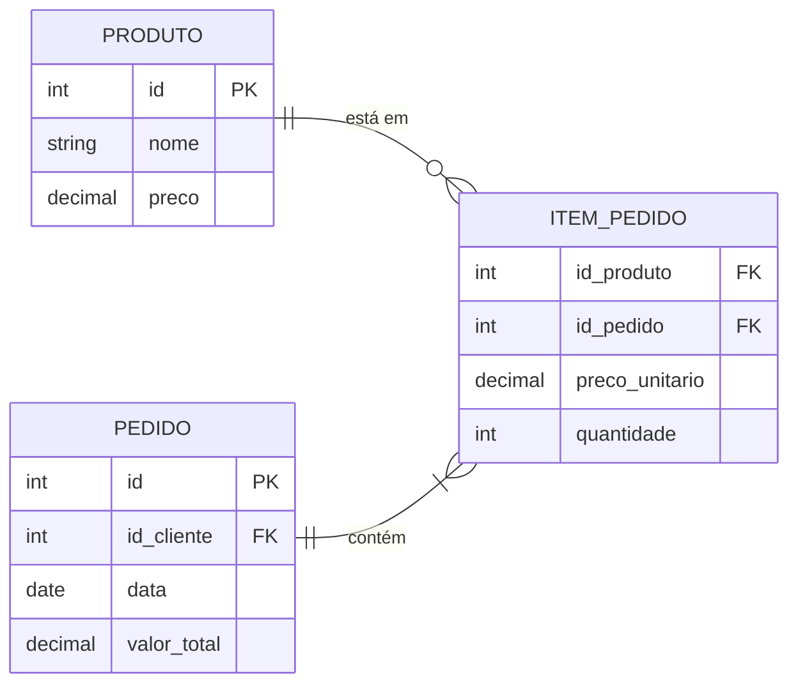

2. Entidade Associativa: No modelo da biblioteca (LIVRO, USUARIO), desenhe o diagrama Crow's Foot que resolve o relacionamento N:M "empresta", criando a entidade EMPRESTIMO. Que atributos EMPRESTIMO teria? (Pense em data de empréstimo, data de devolução, etc.)

3. Entidade Associativa: Considerando um sistema de compras, resolva o relacionamento N:M "faz" da entidade PRODUTO e PEDIDO. A entidade associativa deve conter a quantidade de cada produto, e o preço unitário.

