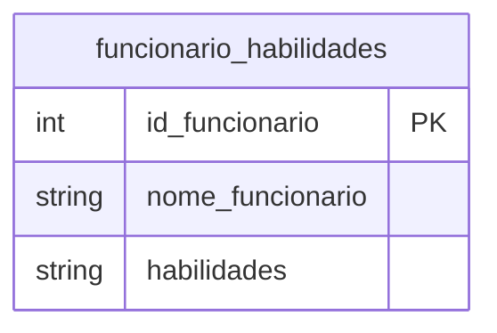
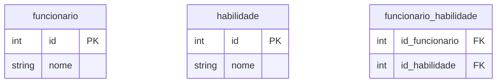

1. 

|id_funcionario|nome_funcionario|habilidades|
|:---:|:---:|:---:|
|1|Carlos|'SQL, Python, Java'|
|2|Bruna|'Power BI, Excel'

# 1ª Forma Normal

### Funcionário
|id|nome|
|:---:|:---:|
|1|Carlos|
|2|Bruna|

### Habilidade
|id|nome|
|:---:|:---:|
|1|SQL|
|2|Python|
|3|Java|
|4|Power BI|
|5|Excel|

### Funcionario_habilidade
|id_funcionario|id_habilidade|
|:---:|:---:|
|1|1|
|1|2|
|1|3|
|2|4|
|2|5|