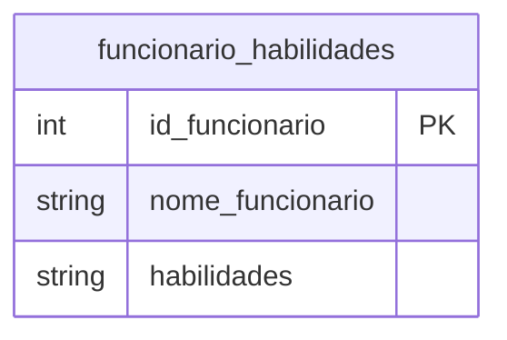
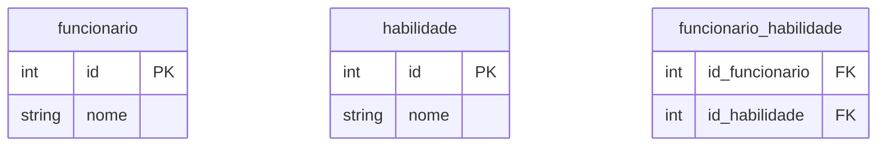
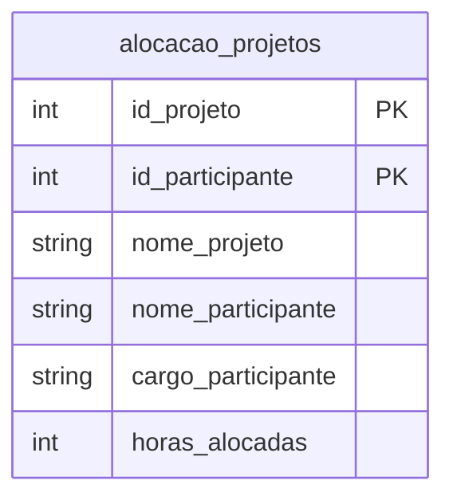
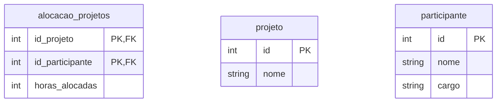
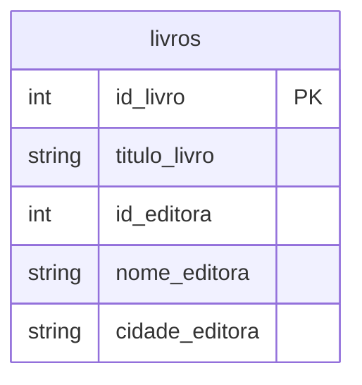
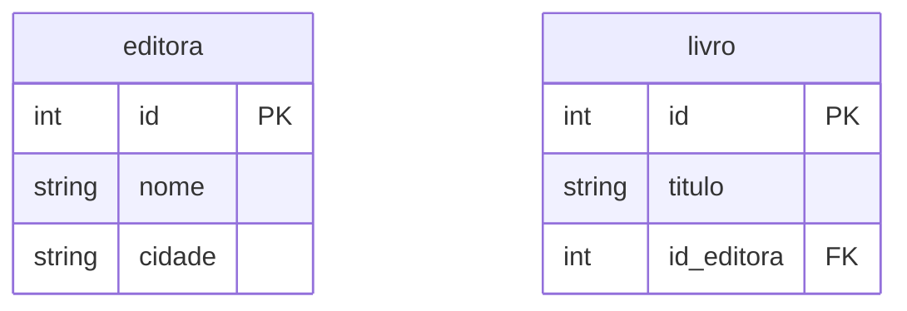
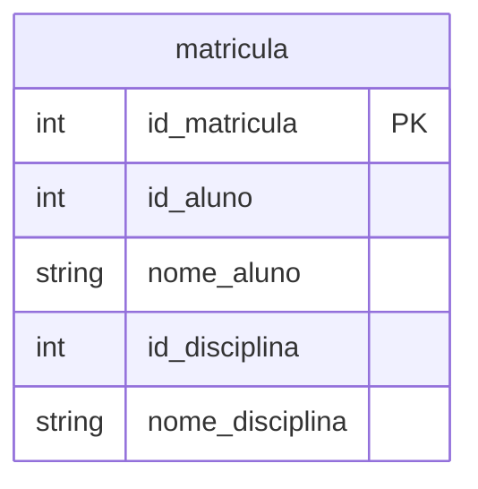
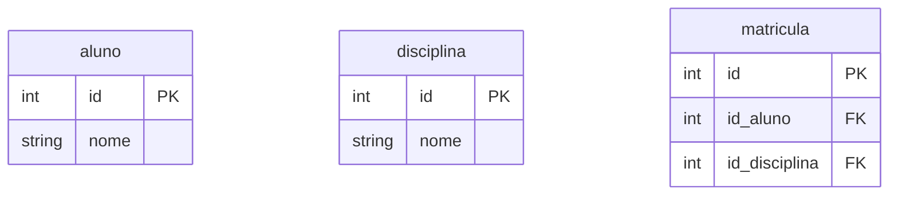

# 1. 

|id_funcionario|nome_funcionario|habilidades|
|:---:|:---:|:---:|
|1|Carlos|'SQL, Python, Java'|
|2|Bruna|'Power BI, Excel'

## 1ª Forma Normal

### Funcionário
|id|nome|
|:---:|:---:|
|1|Carlos|
|2|Bruna|

### Habilidade
|id|nome|
|:---:|:---:|
|1|SQL|
|2|Python|
|3|Java|
|4|Power BI|
|5|Excel|

### Funcionario_habilidade
|id_funcionario|id_habilidade|
|:---:|:---:|
|1|1|
|1|2|
|1|3|
|2|4|
|2|5|

# 2.

Violação 2FN

`nome_projeto` -> depende `id_projeto`
`nome_participante` e `cargo_participante` -> `id_participante` 

### alocacao_projeto
|id_projeto|id_participante|horas_alocadas|
|:---:|:---:|:---:|
|P101|E5|120|
|P101|E8|80|
|P102|E5|90|

### participante
|id|nome|cargo|
|---|---|---|
|E5|Ana|Analista Jr.|
|E8|Pedro|Programador Jr.|

### projeto
|id|nome|
|---|---|
|P101|Zeus|
|P102|Apolo|

# 3.

Viola 3FN
`nome_editora` e `cidade_editora` -> id_editora (não chave)

### editora
|id|nome|cidade|
|---|---|---|
|ED12|Tech Books|São Paulo|

### livro
|id|titulo|id_editora|
|---|---|---|
|L01|SQL para Iniciantes|ED12|
|L02|A Arte da Normalização|ED12|

# 4.

Viola 3FN
`nome_aluno` -> `id_aluno` (não chave)
`nome_disciplina` -> `id_disciplina` (não chave)

### aluno
|id|nome|
|---|---|
|1|Ana|

### disciplina
|id|nome|
|---|---|
|5|Matemática|
|6|Física|

### matricula
|id|id_aluno|id_disciplina|
|:---:|:---:|:---:|
|101|1|5|
|102|1|6|